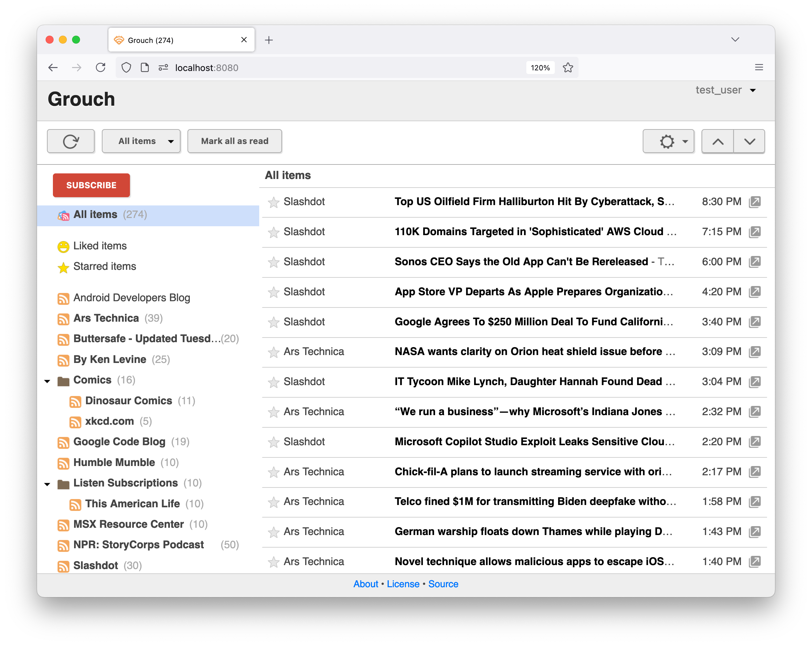

Grouch
==========


**Grouch** is a Feed Reader (Google Reader clone). Its aging UI is based on my earlier work on [Gofr](https://github.com/0xe1f/Gofr/) - a Reader clone I wrote for App Engine in 2013. It's written in Python, with a [CouchDB](https://couchdb.apache.org/) data backend.

Project is currently under active development.



Features
--------

* Folders
* Tagging
* Article and subscription filtering
* Keyboard navigation support with extensive support for Google Reader's keyboard shortcuts (press ? to view available shortcuts)
* OPML import/export
* Mobile browser support
* High-density screen support

Installation
------------

To run locally:

* Ensure that Python 3 interpreter is version 3.12
* Install CouchDB

```
git clone https://github.com/0xe1f/grouch.git`
cd grouch
./setup.sh
. venv/bin/activate

# Create a config.toml file, using config.toml.example as a template
./serve.py   # Start server on port 8080
```

To routinely update feeds, set up a `cron` job that calls `refresh.py`:

```
. venv/bin/activate
./refresh.py -f 30 # Update feeds older than 30 minutes
```
