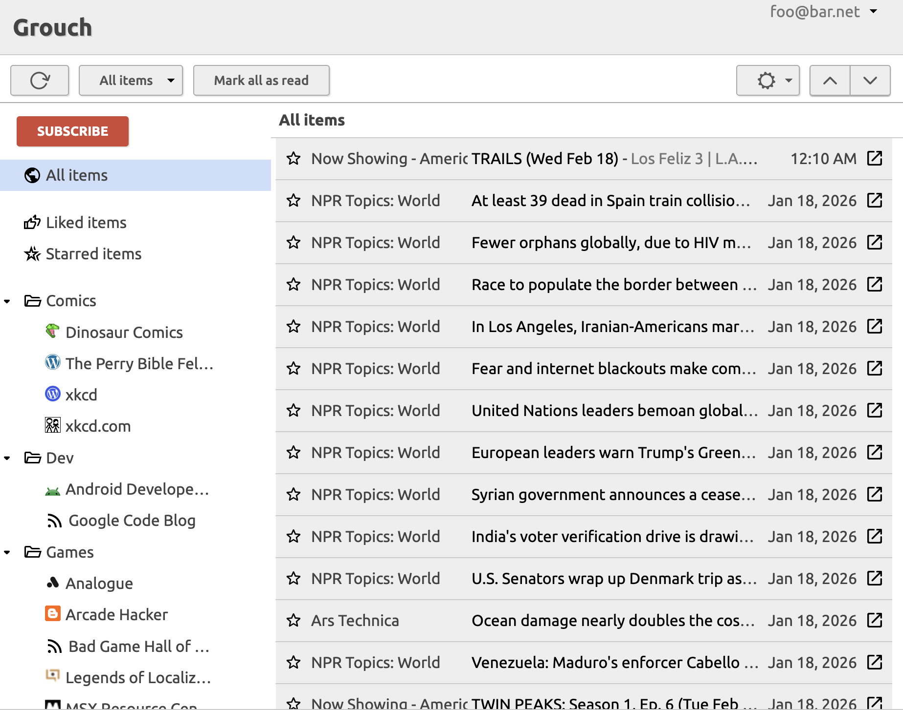

Grouch
==========

**Grouch** is a Feed Reader (Google Reader clone). Its aging UI is based on my earlier work on [Gofr](https://github.com/0xe1f/Gofr/) - a Reader clone I wrote for App Engine in 2013. It's written in Python, with a [CouchDB](https://couchdb.apache.org/) data backend. Deployment is supported via [Docker](Docker/README.md) for local and self-hosted setups, or [Google Cloud Run](gcloud/README.md) for managed cloud hosting.

Project is currently under active development.

Features
--------

* Folders
* Tagging
* Article and subscription filtering
* Keyboard navigation support with extensive support for Google Reader's keyboard shortcuts (press ? to view available shortcuts)
* OPML import/export
* Mobile browser support
* High-density screen support

Deployment
----------

* [Docker](Docker/README.md)
* [Google Cloud Run](gcloud/README.md)
