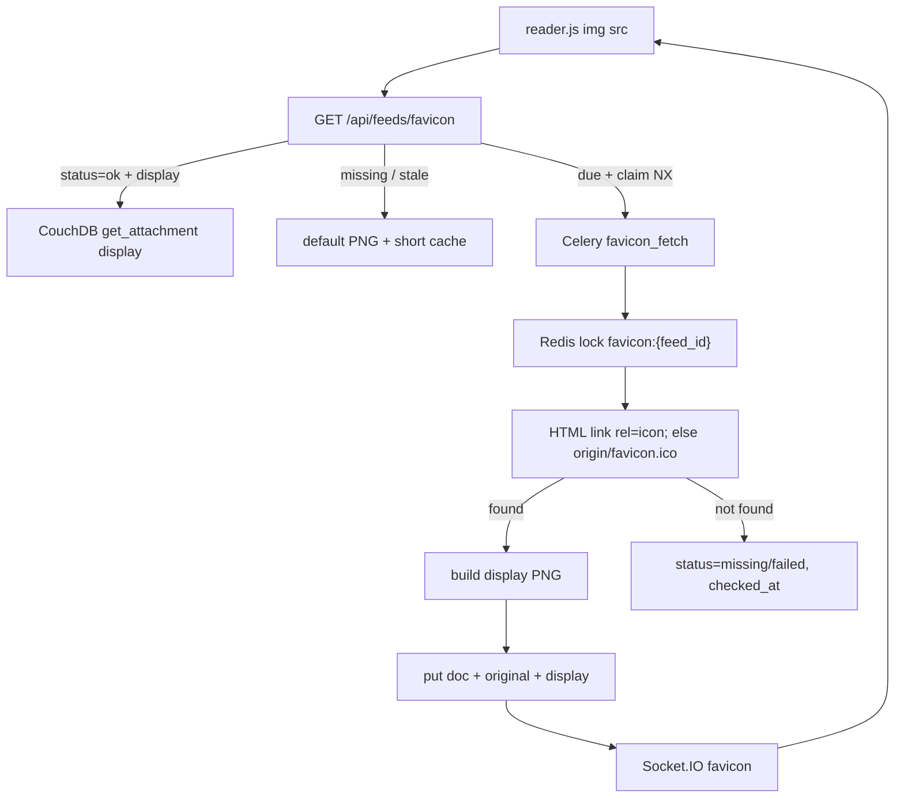

# Feed favicons

## Overview
Stop guessing `{origin}/favicon.ico` in the browser. Store discovered favicons independently of `Feed`, serve them from Grouch, and fetch/retry asynchronously when missing.

## Decisions (confirmed)

| Decision | Choice |
|----------|--------|
| Identity | Key by **feed id** (`favicon::{feed_id}`) — not by site origin |
| Decoupling | **Remove** `favicon_url` from `Feed` / `computed_digest` / subscription DTO |
| Storage | CouchDB doc + attachments (`original` + `display`) — no separate filesystem |
| Serve | Always **`image/png`** from the `display` attachment, or a default placeholder |
| Discover | Lazy: serve path enqueues fetch on miss/stale; do not block HTTP on network discovery |
| Notify | Socket.IO when display bytes change; client swaps `img.src` |
| Refresh | **Success → re-check monthly**; **failure/missing → retry weekly** |
| Dedup | Redis claim on enqueue + Redis lock in task |
| Auth | **Login required**; user must subscribe to the feed |
| Read cache | Long `Cache-Control` + `ETag` (`content_hash`) on real icons; short/no-store on placeholder |
| Formats | **Store** original type/bytes; **serve** normalized PNG |
| Display box | **20×20 CSS px** (match folder/special/no-favicon icons) |
| Display target | **60×60** max edge (20 CSS × 3 DPR) — **never upscale** rasters |
| Inbound limits | Discard if payload **> 1 MiB** or decoded raster **> 512 px** in either dimension |

## Current state (verified)

**Client** ([web/static/js/reader.js](../../web/static/js/reader.js)): ignores `favIconUrl`; rewrites `subscription.link` → `{origin}/favicon.ico`; on error, transparent PNG + `no-favicon`. Session-sticky: rebuild skips previously failed subs.

**Backend:** `Feed.favicon_url` exists and is in `computed_digest`, but parse never sets it (`TODO` in [parser/parse.py](../../parser/parse.py)). API still serializes `faviconUrl`. Because the field is never written, removing it from the entity/hash keys does not change digests for existing feed docs.

**Discovery gaps today:** `{origin}/favicon.ico` alone misses a meaningful share of sites (on the order of ~1 in 4 in a sample corpus) that only declare `<link rel="icon">` (often PNG/SVG on a CDN). Full HTML-link discovery recovers most of the rest (sample hit rate high-80s%). Some feeds set `site_url` to a feed path rather than a homepage — discovery must fall back to the origin root. Failures tend to be bot-blocked origins or sites with no usable icon at all.

## Target architecture

## Why `content_hash` (vs `source_hash`)

| Field | Hashes | Used for |
|-------|--------|----------|
| `source_hash` | **Original** downloaded bytes | Skip rewrite after re-fetch when the remote icon is unchanged |
| `content_hash` | **`display` PNG** we actually serve | HTTP `ETag`, client `?v=`, socket cache-bust URL |

`source_hash` answers “did the site’s icon bytes change?”  
`content_hash` answers “did what we show the user change?”

They usually move together, but not always: if we change rasterize rules and rebuild `display` from the same `original`, `source_hash` stays put while `content_hash` must change so browsers drop the old PNG. Keep both; they are cheap.

## Storage: CouchDB doc + attachments

| What | Where |
|------|--------|
| Metadata | CouchDB `favicon::{feed_id}` |
| Original bytes | Attachment `original` (content-type = source type) |
| Serve PNG | Attachment `display` (`image/png`) |

Uses existing CouchDB durability (already volume-backed in deploy). App and worker already share the DB over the Docker network — **no new volumes, no shared filesystem**. couchdb-python `Database.put_attachment` / `get_attachment` (CouchDB==1.2 in [requirements.txt](../../requirements.txt)).

**Hot path:** authz → load doc (or lightweight check) → `get_attachment(..., "display")` → response with `ETag: content_hash` + long cache. Browser caching means repeat sidebar loads rarely hit Couch at all.

**Write path:** task upserts doc fields, then puts `original` + `display` attachments (handle `_rev` — put attachments after doc save; on conflict, reload and retry once). If revalidation finds unchanged `source_hash`, only bump `checked_at` (no attachment rewrite).

**Size:** favicon payloads are tiny vs entry/article bodies; storage overhead is not a concern at expected feed counts.

### Rescan notes (CouchDB choice)

| Topic | Status |
|-------|--------|
| App/worker visibility | OK — both talk to the same CouchDB |
| Deploy / `--rm` containers | OK — data lives in Couch volume, not container FS |
| Extra Docker/GCE volume | **Not needed** (reverted from disk plan) |
| Feed `_rev` contention | OK — separate `favicon` docs; never touch `Feed` for icons |
| Attachment API | Available via couchdb-python; not used elsewhere yet — thin DAO wrapper |
| BulkUpdateQueue | Not required for favicons (single-doc writes); use direct save + put_attachment |
| Schema / views | Need `subs_by_feed` for notify fan-out; bump schema version (coordinate with per-feed pipeline if concurrent) |
| Failure keeping prior icon | On failed revalidation of an `ok` icon, leave existing attachments; only update `checked_at` / optionally leave status `ok` until policy says otherwise (recommended: keep serving last good `display`) |

## Display sizing (grounded in current CSS)

Today in [web/static/style/reader.css](../../web/static/style/reader.css):

- Leaf `.subscription-icon` is **16×16**.
- Folder / special / **no-favicon** title glyphs use **`background-size: 20px 20px`**.

So missing-favicon leaves already render at 20×20 while hotlinked favicons sit at 16×16. **Align leaf favicons to 20×20** for sidebar uniformity (change `.subscription-icon` to 20×20 as part of this work).

| Device pixel ratio | Pixels needed for a sharp 20 CSS px icon |
|--------------------|------------------------------------------|
| 1× | 20 |
| 2× (common Retina laptops) | 40 |
| 3× (many phones) | 60 |

**Target edge: 60 px** (exact 3× at 20 CSS px).

### Resize / rasterize rules

| Source | Action |
|--------|--------|
| **Vector** (SVG) | Rasterize at **60×60** (fit inside, aspect preserved, transparent pad). |
| **Raster smaller than 60×60** on both edges | **Do not upscale.** Convert to PNG at native dimensions (e.g. 16×16 stays 16×16). |
| **Raster larger than 60×60** on either edge | **Downscale** to fit inside 60×60 (aspect preserved, transparent pad if needed). |
| Already-PNG and already ≤60×60 | Still store as `display` PNG (re-encode OK); dimensions unchanged. |

Multi-size ICO: pick the best frame (prefer ≥60 when present, else largest ≤60); then apply the raster rules. Animated GIF/WebP: first frame only.

### Inbound sanity checks

Real favicons are typically a few KB (rarely tens of KB). Common declared sizes include 16/32/48, apple-touch **180**, and Android chrome **192**; CDN icons sometimes land in the **300–400** px range.

| Limit | Value | Rationale |
|-------|-------|-----------|
| Max payload | **1 MiB** | Far above normal favicon sizes; catches accidental full-page/asset downloads and huge SVGs. Leaves margin for a clean 512×512 PNG. |
| Max dimension | **512 px** | Allows common 180/192 touch icons and larger CDN favicons; rejects mistaken og:image / screenshot links. Apply after decode (and for ICO, per selected frame). SVG: only the 1 MiB byte cap before render. |

Reject and try the next candidate (then fall through to missing/failed). Min payload ~16 B remains to drop empties.

## Data model

Entity `Favicon` (`doc_type = "favicon"`):

| Field | Purpose |
|-------|---------|
| `_id` | `favicon::{feed_id}` via `Entity.build_key("favicon", feed_id)` |
| `feed_id` | Source feed |
| `status` | `ok` / `missing` / `failed` |
| `checked_at` | Unix timestamp of last attempt |
| `source_url` | URL or `data:…` we took the bytes from |
| `content_type` | **Original** media type |
| `source_hash` | Hash of **original** bytes |
| `content_hash` | Hash of **display** PNG (`ETag` / `?v=`) |
| `width` / `height` | Dimensions of `display` (≤60) |
| `_attachments.original` | Original image bytes |
| `_attachments.display` | Serve PNG (≤60×60, never upscaled) |

No content digest on this doc — operational only. Not tied to feed `_rev`.

Schema: bump `_SCHEMA_VERSION_CURRENT` to 4; add view `subs_by_feed` (`emit(doc.feed_id)` for `doc_type == 'sub'`) for notify fan-out. (Share bump with [per-feed-fetch-pipeline.md](per-feed-fetch-pipeline.md) if that lands in the same window.)

## Refresh cadence

| Last outcome | Re-fetch when |
|--------------|---------------|
| `ok` | `checked_at` older than **30 days** |
| `missing` / `failed` | `checked_at` older than **7 days** |
| No doc / no `display` attachment | due immediately (enqueue on serve) |

Config: `FAVICON_OK_REFRESH_DAYS=30`, `FAVICON_RETRY_DAYS=7`.

## Dedup: two users, same feed, same moment

1. **Enqueue claim** (Flask, before `delay`): `SET favicon_queued:{feed_id} 1 NX EX <short TTL>` (e.g. 5–10 minutes). Only the first request enqueues.
2. **Task lock** (Celery): `SET favicon_lock:{feed_id} 1 NX EX <task TTL>`. Second task exits without fetching.

One network discovery per feed per wave. Notify via Socket.IO when display changes (`subs_by_feed` fan-out + optional `notify_user_id` from the claimer).

## Discovery algorithm

Given feed `site_url` (and `feed_url` as weak fallback):

1. GET `site_url` HTML (cap size, timeout, browser-like `User-Agent`).
2. If body is non-HTML or URL path looks feed-like (`/feed`, `/rss`, `/atom`, etc.), GET `{origin}/` instead.
3. Parse `<link rel="icon"|"shortcut icon"|"apple-touch-icon"… href>` (and optional `type=` / `sizes=`); prefer candidates whose `sizes` are ≥60 when present, else `rel=icon`.
4. For each candidate `href`, **materialize original bytes**:
   - **`data:` URL** — parse media type + payload; keep decoded bytes; `content_type` from the data-URL header (fallback: sniff).
   - **`http(s):` URL** — GET as-is; keep body verbatim; type from `Content-Type` or sniff.
   - **Relative URL** — resolve against the HTML final URL, then same as http(s).
5. Sanity-check: drop if `len(bytes) > 1 MiB` or `< ~16 B`. Sniff type; decode rasters; drop if width or height **> 512**.
6. Else GET `{origin}/favicon.ico` and validate the same way.
7. On success → build `display` → save doc + attachments (`status=ok`, hashes, `checked_at`).
8. On failure → `status=missing`/`failed`, `checked_at=now`; keep prior attachments if revalidating an ok icon.

SSR / safety: only follow `http(s)` from the page; allow `data:` image payloads from `<link>` only; reject private/link-local literals; cap redirects.

## Store original / serve PNG

- **Store** original bytes as attachment `original` + `content_type` / `source_hash` on the doc.
- **Serve** only attachment `display` as `Content-Type: image/png`.
- Build `display` in the Celery task (Pillow + SVG renderer dependency). Apply resize rules above.

## Source hash on revalidation

After a due re-fetch, if `source_hash` matches: bump `checked_at` only — **no** attachment rewrite, **no** notify.  
If it changed (or first success): put attachments, update `content_hash`, notify.

## HTTP API

`GET /api/feeds/favicon?feed_id=…` (login required)

1. 403/404 if current user has no subscription for `feed_id`.
2. If doc `status=ok` with `display` and not due → stream attachment + `ETag` / long cache headers.
3. Else → placeholder + short/no-store cache; if due, `SET NX` claim then `favicon_fetch.delay(...)`.

Optional: `HEAD` for cheap freshness checks.

## Celery task

`favicon_fetch(feed_id, notify_user_id=None)`:

- Acquire `favicon_lock:{feed_id}`; skip if held.
- Discover; apply `source_hash` short-circuit; write doc + attachments as needed.
- Clear enqueue claim when finished (or let TTL expire).
- Notify on display change only: `{ feedId, url: "…&v=<content_hash>" }` to claimer + `subs_by_feed` users.

## Client changes

In [web/static/js/reader.js](../../web/static/js/reader.js):

- Expose `feedId` on subscription JSON ([web/ext_type/objects.py](../../web/ext_type/objects.py)); drop `faviconUrl`.
- `img.src = /api/feeds/favicon?feed_id=…` (no third-party hotlink).
- Remove `faviconless` / `{origin}/favicon.ico` guessing.
- On socket `favicon`, find rows for that `feedId`, set versioned `img.src`, clear `no-favicon`.

## Remove from Feed

- Delete `favicon_url` property and remove from `hash_keys` in [entity/feed.py](../../entity/feed.py).
- Remove parse TODO; stop setting `faviconUrl` on API subscription objects.
- Update [tests/test_entities.py](../../tests/test_entities.py).
- No data migration: `favicon_url` was never written to feed docs.

## Steps

1. **Entity + DAO** — `Favicon` entity; get/put doc; `put_attachment` / `get_attachment` for `original` + `display`. Wire onto `Database`.
2. **Schema** — version bump + `subs_by_feed` view.
3. **Deps** — Pillow (+ SVG rasterizer); pin in `requirements.txt`.
4. **Discovery + display builder** — limits + resize rules; unit tests.
5. **Celery task** — claim/lock, discover, `source_hash` short-circuit, Couch write, notify; config for refresh days, size, limits.
6. **Flask route** — authz, stream `display` or placeholder, enqueue-with-NX.
7. **Client + CSS** — `feedId`, socket handler; `.subscription-icon` → **20×20**; drop old guess logic.
8. **Strip Feed.favicon_url** — entity, API, tests; [docs/deferred.md](../deferred.md) item 9 points here.
9. **Tests** — attachment serve path; claim prevents double enqueue; lock skips second task; cadence ok vs fail; hash short-circuit; resize rules; keep last-good display on failed revalidation.

## Out of scope (follow-ups)

- Proactive fetch inside the per-feed feed pipeline ([per-feed-fetch-pipeline.md](per-feed-fetch-pipeline.md)).
- nginx / CDN caching in front of the favicon route (browser `Cache-Control` is enough initially).
- Origin-keyed sharing across feeds that share a site.
- Admin UI to inspect/force-refresh favicons.
- Filesystem/object-store backend (rejected for v1 — needs shared durable volume across app/worker).

## Open knobs (defaults fine to ship)

- Placeholder asset: static `favicon.png` vs transparent 1×1 for sidebar density.
- Whether to honor `mask-icon` (low priority; skip unless no other candidate).
- SVG library choice (cairosvg vs resvg) — whatever installs cleanly in Docker.
- Hash algorithm: sha256 (truncate for shorter `?v=` if desired).
- Enqueue-claim TTL vs task lock TTL (claim ≤ typical task runtime upper bound).
- On failed revalidation of an ok icon: keep serving last good `display` (recommended) vs flip status to `failed` immediately.
