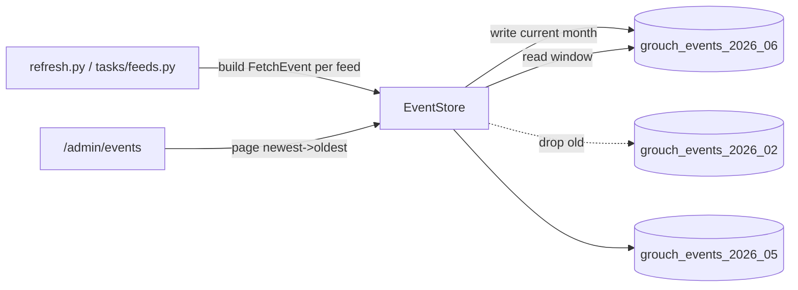

# Fetch Event Logging

## Goal
Record the outcome of every feed we look at during a refresh (304 not-modified, 200 unchanged, updated with metadata/entry deltas, 404, network/parse errors), store it durably with a bounded retention window, and expose it in the admin section as a descending, feed-filterable list.

## Decisions (confirmed)
- Storage: monthly-rotated dedicated CouchDB databases; retention = drop old DB.
- Design for up to ~5,000 feeds (do not hardcode to current count of 21).
- Autocomplete: prefix-match views.

## Storage model: monthly-rotated databases
Fetch events live in dedicated CouchDB databases separate from the main app DB, named per month: `{DATABASE_NAME}_events_YYYY_MM` (e.g. `grouch_events_2026_06`).

- Writes go to the current month's DB (created on demand with its design doc).
- Retention = dropping month DBs older than `EVENT_RETENTION_MONTHS` (default 3). Instant, full space reclamation, no compaction/tombstone bloat.
- Reads span the DBs in the window, consumed newest-to-oldest. Because each month's timestamps are disjoint, sequential paging across DBs yields correct global descending order without merge-sorting.

## Event document fields
`doc_type = "fetch_event"`, fields: `timestamp` (float), `feed_id`, `feed_url`, `feed_title`, `site_url` (denormalized so display/filter survives feed deletion), `outcome` (enum: `not_modified` / `unchanged` / `updated` / `not_found` / `failed`), `http_status` (int|None), `metadata_changed` (bool), `entries_changed` (int), `error` (str|None).

## Proposed admin columns
Time, Feed (title linking to `feed_url`), Outcome (badge), HTTP status, Metadata changed, Entries (+N), Detail/error. Sort: time descending (default). Filter: by feed via autocomplete.

## Step 1 - Capture status codes & errors in the parser
In `parser/parse.py` and `parser/defs.py`:
- Add `status_code: int|None` and `error: str|None` to `_Fetched` and `ParseResult`.
- In `_fetch_url`, set `status_code` on all paths (304, 200, 404, other) and capture the exception/timeout message into `error` instead of just logging and returning `None`.
- Thread these through `parse_feed` / `_parse_feed` so the result carries the real HTTP status and failure reason.

## Step 2 - Don't drop exceptions in the fetch pool
In `tasks/feeds.py` `_fetch_feeds`, the `except` branch currently only logs. Produce a `ParseResult(url, error=...)` so exception URLs land in the `failed` bucket and get an event.

## Step 3 - EventStore (new) + entity
- New `entity/fetch_event.py` (`FetchEvent(Entity)`, `DOC_TYPE = "fetch_event"`) following the `entity/feed.py` pattern with typed properties.
- New `dao/events.py` `EventStore`:
  - Holds a `couchdb.Server` (reuse the URL build in `dao/connection.py`).
  - `month_db(dt)` / `ensure_month_db(dt)`: get-or-create `{base}_events_YYYY_MM`, install design doc with views `events_by_time` (emit `doc.timestamp`) and `events_by_feed_time` (emit `[doc.feed_id, doc.timestamp]`).
  - `write_events(events)`: bulk `db.update` into the current month DB.
  - `iter_events(feed_id=None, start_cursor=None, limit=40)`: descending paging across window DBs; cursor = obfuscated `{db, startkey, startkey_docid}`.
  - `list_event_dbs()` / `drop_old_dbs(retention_months)`.
- Add `EVENT_RETENTION_MONTHS = 3` to `settings.toml.example` / config.

## Step 4 - Emit events during refresh
In `tasks/feeds.py` `_freshen_stale_feed`, where outcomes and `feed_meta_changed` / `feed_entries_changed` are already computed: build a `FetchEvent` for each `not_modified`, `failed`, and `successful` result (using `local_feed_map[url]` for denormalized feed fields and the new `status_code`/`error`), then `event_store.write_events(...)`. Keep the existing `logging.info` lines.
- Instantiate the `EventStore` in `refresh.py` alongside `Connection`/`Database` and pass it through `refresh_feeds` -> `_freshen_stale_feed`.
- Call `event_store.drop_old_dbs(...)` once per run in `refresh.py`.
- Scope: refresh path only. Logging the import/subscribe path is deferred (note in `docs/deferred.md`).

## Step 5 - Feed-search autocomplete (prefix views)
- Bump schema version in `dao/connection.py` and add 3 prefix views on the main DB emitting lowercased, normalized keys -> `{id, title, feed_url, site_url}`: by title, by `feed_url`, by `site_url`. URL keys are normalized (strip scheme + leading `www.`) so typing `example.com` matches.
- Add `FeedDao.search_prefix(q, limit)` in `dao/feeds.py` querying the 3 views with `startkey=q`, `endkey=q+"\ufff0"`, dedupe by feed id.
- New route `GET /admin/feeds/search?q=` in `web/admin.py` returning suggestions.

## Step 6 - Admin "Fetch Events" page
- Add a menu item in `get_menu_items()` in `web/admin.py`.
- New `GET /admin/events` (renders template) and `GET /admin/events/list` (JSON, `feed_id` + obfuscated `start` cursor, same pattern as `feeds_list`).
- New template `web/templates/admin/events.html` modeled on `web/templates/admin/feeds.html`: table skeleton + jQuery AJAX paging ("Continue"), an outcome badge per row, and a feed-filter input wired to `/admin/feeds/search` with a `<datalist>`/dropdown; selecting a feed reloads the list with `feed_id`.
- Add nav-icon + outcome-badge CSS in `web/static/style/admin.css`; add `.next-page` styling if missing.
- Instantiate `EventStore` in `web/serve.py` and store it on `app.extensions` so admin routes can read it.

## Notes / decisions
- Outcome distinguishes `not_found` (404) from generic `failed` using the new `http_status`.
- `entries_changed` keeps the existing combined (added + updated) count; splitting added vs updated is deferred.
- Autocomplete is prefix-match per your choice; substring matches are out of scope.

## Open questions / answered
- CouchDB never shrinks: addressed via monthly-rotated DBs (drop to reclaim), avoiding tombstone/compaction bloat in the main DB.
- Columns: proposed above.
- Filter by feed (url / site url / title) with autocomplete: prefix views + `/admin/feeds/search`.
