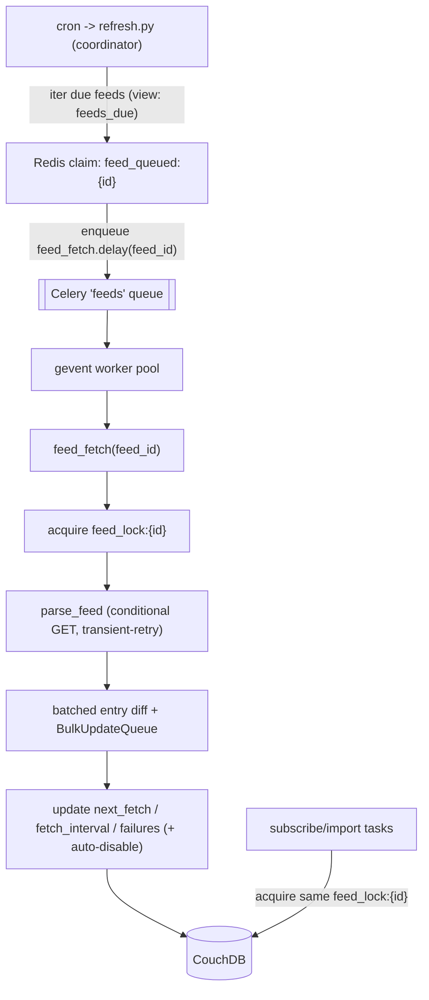

# Per-feed fetch pipeline

## Overview
Re-architect feed fetching from a single monolithic cron scan into a coordinator that enqueues per-feed Celery tasks on a gevent pool, with per-feed locking for atomicity, adaptive per-feed scheduling, and exponential backoff + auto-disable + transient-retry error handling.

## Current state (verified)

- Two uncoordinated writers of the same `feed`/`entry` docs: the cron process [refresh.py](../../refresh.py) -> [refresh_feeds](../../tasks/feeds.py) and the Celery subscribe/import tasks in [tasks/subscriptions.py](../../tasks/subscriptions.py). `@per_user` in [tasks/celery_app.py](../../tasks/celery_app.py) serializes per user, not per feed.
- `_freshen_stale_feed` fetches 40 at a time via `ThreadPoolExecutor(max_workers=10)`, diffs entries with a per-feed `iter_by_uid` view call (N+1), and writes through one shared `BulkUpdateQueue` that silently drops `ResourceConflict` (409).
- `iter_updated_before` in [dao/feeds.py](../../dao/feeds.py) returns stale feeds **newest-stale-first** (`descending=True, startkey=stale_start`), so any cap/time-box starves the oldest feeds.
- No per-feed cadence, failure tracking, or backoff. Article fan-out (`subs_sync`) is on-demand and out of scope.

## Target architecture

Each feed's fetch -> parse -> diff -> write -> reschedule becomes one self-contained task. Parallelism comes from many tasks on a gevent pool (overlaps network wait; 304s skip parse, so steady-state CPU is low). Atomicity comes from a per-feed Redis lock shared by the refresh tasks and the subscribe path.

## Design decisions

- **Coordinator stays cron-triggered** (reuse existing cron) but only enqueues; it does not fetch or write feed docs. Dedup/claim via a Redis marker `feed_queued:{feed_id}` (TTL ~ interval) so the coordinator never writes `next_fetch` itself and can't conflict with a running task. `next_fetch` is written only by the task.
- **Per-feed lock key derived from the deterministic feed id** (`feed::{url}`), so the subscribe path (which knows only the URL) and the refresh task (which knows the feed) compute the same key.
- **Scheduling state lives on the Feed** as operational metadata excluded from `computed_digest()` (same pattern as `etag`/`last_modified` in [entity/feed.py](../../entity/feed.py)).
- **Atomicity via lock, not conflict-retry** (per chosen scope): the lock removes the collision at the source, so `BulkUpdateQueue` is left as-is.

## Steps

### 1. Feed scheduling/error fields + migration
- In [entity/feed.py](../../entity/feed.py) add operational props (NOT in `hash_keys`): `next_fetch` (float), `fetch_interval` (int secs), `consecutive_failures` (int). `disabled` already exists for auto-disable.
- In [dao/connection.py](../../dao/connection.py) bump `_SCHEMA_VERSION_CURRENT` to 4; add a `from_ver < 4` block that adds a `feeds_due` view emitting `doc.next_fetch` for `doc_type == 'feed' && !doc.disabled`. Backfill: existing feeds have no `next_fetch`; emit `0` when absent so they are immediately due (natural staggering happens as tasks set real values).

### 2. Due-feed query + claim
- Add `FeedDao.iter_due(now, limit)` in [dao/feeds.py](../../dao/feeds.py) querying `feeds_due` with `endkey=now` ascending (oldest-due first - fixes the ordering bug).
- Add a Redis claim helper in [tasks/celery_app.py](../../tasks/celery_app.py): `claim_feed(feed_id)` -> `_redis.set(f"feed_queued:{id}", 1, nx=True, ex=...)`.

### 3. Per-feed lock helper
- In [tasks/celery_app.py](../../tasks/celery_app.py) add a `feed_lock(feed_id)` context manager mirroring `per_user` (Redis `set nx ex`), returning whether acquired so callers can skip if already held.

### 4. `feed_fetch` per-feed task
- New task in [tasks/feeds.py](../../tasks/feeds.py): `feed_fetch(self, feed_id)` (bind=True), routed to a `feeds` queue.
  - Acquire `feed_lock:{feed_id}`; if not acquired, return (someone else owns it).
  - Load the feed (fresh `_rev`), call `parse_feed(url, etag, last_modified)`.
  - **Transient errors** (timeout / connection / 5xx): `self.retry()` with exponential backoff, bounded `max_retries`.
  - **Success (200 changed)**: batched entry diff (reuse `_freshen_stale_feed` logic, but collect all uids and do one `iter_by_uid`), enqueue feed+entries; shrink `fetch_interval` toward a min; reset `consecutive_failures`.
  - **304 / 200-unchanged**: persist refreshed validators; grow `fetch_interval` toward a max.
  - **Persistent failure** (404 / parse / exhausted retries): increment `consecutive_failures`, grow `next_fetch` backoff exponentially; if `>= FETCH_MAX_FAILURES`, set `disabled = True`.
  - Always set `next_fetch = now + fetch_interval` (or backoff) and write the feed; clear the Redis claim.
  - Emit a fetch outcome for surfacing (align with [docs/plans/fetch-event-logging.md](fetch-event-logging.md); if that store isn't built yet, structured `logging` now and wire the EventStore when it lands).

### 5. Coordinator rewrite
- Rewrite `refresh_feeds` in [tasks/feeds.py](../../tasks/feeds.py) to iterate `dao.feeds.iter_due(now)`, and for each not-already-claimed feed call `feed_fetch.delay(feed_id)`. Optional per-tick enqueue cap (`FETCH_COORDINATOR_MAX_ENQUEUE`).
- Keep [refresh.py](../../refresh.py) as the cron entry, but it now just builds the DAO and calls the coordinator (no fetching). Consider tightening `CRON_SCHEDULE` so due feeds are picked up promptly.

### 6. Subscribe/import atomicity
- In [tasks/subscriptions.py](../../tasks/subscriptions.py) (`import_feeds` / `_subscribe_user` path in [tasks/feeds.py](../../tasks/feeds.py)), acquire `feed_lock:{feed_id}` (derived from URL) around the fetch+write of a new feed, and skip the fetch if the feed already exists (re-check `map_metadata_by_url` after acquiring). Set `next_fetch`/`fetch_interval` on newly created feeds so the coordinator picks them up on cadence.

### 7. Worker / queue config
- Add a dedicated feeds worker (gevent pool) consuming the `feeds` queue, e.g. a new script alongside [Docker/app/etc/worker.sh](../../Docker/app/etc/worker.sh): `celery -A tasks.celery_app worker -Q feeds --pool=gevent --concurrency=${FEEDS_CONCURRENCY:-50}`. Keep the existing prefork worker for per-user tasks (default queue).
- Add task routing in [tasks/celery_app.py](../../tasks/celery_app.py) (`task_routes`) so `feed_fetch` -> `feeds`.
- Note: parse/sanitize is GIL-bound; gevent overlaps network only. For multi-core parse at high feed counts, run multiple feeds-worker replicas. Add config knobs to [settings.toml.example](../../settings.toml.example): `FETCH_INTERVAL_MIN/MAX_MINUTES`, `FETCH_MAX_FAILURES`, `FETCH_TRANSIENT_RETRIES`, `FEEDS_CONCURRENCY`.

### 8. Tests
- Extend [tests/test_parser.py](../../tests/test_parser.py) / add task tests: transient-retry path, backoff growth on failure, auto-disable at threshold, interval shrink/grow, and lock-contention skip. Reuse fixtures in `tests/resources/`.

## Open considerations to confirm during implementation
- Exact min/max interval defaults and the failure threshold for auto-disable.
- Whether to also add a manual "re-enable + reset failures" admin affordance for auto-disabled feeds (could be a small follow-up).
- Coordinator cron cadence vs. switching to Celery beat (cron is lower-infra and sufficient at 1-min granularity).
